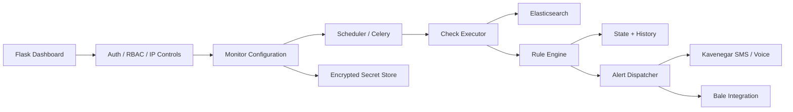

# ELK-Checker

<p align="center">
  <strong>Elasticsearch monitoring, rule evaluation and alert orchestration dashboard</strong><br/>
  Flask • Elasticsearch • scheduled checks • encrypted secrets • role-based management • SMS / voice / Bale integrations
</p>

<p align="center">
  
  
  
  
  
  
</p>

---

## Overview

**ELK-Checker** is a cross-platform monitoring dashboard that executes configured Elasticsearch checks, evaluates result rules, tracks state/history and dispatches notifications when conditions are met or repeated query failures occur.

It includes authentication, user management, IP access controls, encrypted local secret storage, monitor scheduling and notification integrations.

## Platform support

| Platform | Support | Notes |
|---|---|---|
| Linux | ✅ Full | Recommended for always-on service deployments |
| Windows 10/11 | ✅ Full | Python service / local dashboard |
| macOS | ✅ Full | Python service / local dashboard |

Redis/Celery are optional and are only needed when distributed task execution is enabled.

## Architecture



## Core capabilities

- Multiple Elasticsearch server profiles
- Scheduled monitor execution
- Query validation and deterministic query building helpers
- Rule evaluation over returned results
- State tracking and alert history
- Recovery notifications
- Consecutive-error escalation
- Kavenegar SMS and TTS call integration
- Optional Bale dispatch integration
- Local encrypted secret persistence
- User / superuser management
- Session timeout controls
- IP allow/deny controls
- Login failure tracking
- Optional Celery + Redis execution mode

## Security posture

The public version was audited before publication:

- no real API keys were retained
- no real passwords were retained
- no real phone numbers were retained
- runtime JSON files are ignored
- the default web bind is **127.0.0.1**
- the initial administrator password is taken from `ELK_ADMIN_PASSWORD`; if omitted, a random bootstrap password is printed once at first initialization
- Flask session signing uses `SECRET_KEY` when configured, otherwise a locally persisted random secret is generated

See [`SECURITY.md`](SECURITY.md) for deployment rules.

## Requirements

- Python **3.10+**
- Elasticsearch 8.x / 9.x endpoint reachable from the host
- Redis only when `USE_CELERY=1`

Install:

```bash
python -m venv .venv
```

Linux / macOS:

```bash
source .venv/bin/activate
pip install -r requirements.txt
```

Windows PowerShell:

```powershell
.\.venv\Scripts\Activate.ps1
pip install -r requirements.txt
```

## Configuration

```bash
cp .env.example .env
```

Windows:

```powershell
Copy-Item .env.example .env
```

Minimum production values:

```dotenv
SECRET_KEY=<high-entropy-random-value>
ELK_ADMIN_PASSWORD=<strong-unique-password>
```

Optional notification values:

```dotenv
KAVENEGAR_API_KEY=
KAVENEGAR_SENDER=
KAVENEGAR_CONTACTS=
```

## Run

Linux / macOS:

```bash
export $(grep -v '^#' .env | xargs)
python app.py
```

Windows PowerShell:

```powershell
Get-Content .env | ForEach-Object {
  if ($_ -match '^([^#][^=]*)=(.*)$') { Set-Item -Path "env:$($matches[1])" -Value $matches[2] }
}
python app.py
```

Default local URL:

```text
http://127.0.0.1:14061
```

## Optional Celery mode

Start Redis, then set:

```dotenv
USE_CELERY=1
REDIS_URL=redis://127.0.0.1:6379/0
```

The application can then route monitor execution through Celery workers.

## Project structure

```text
ELK-Checker/
├─ elkcheck/
│  ├─ persistence/
│  ├─ routes/
│  ├─ services/
│  └─ tasks/
├─ static/
├─ templates/
├─ data/
├─ app.py
├─ KaveNegar.py
├─ .env.example
├─ requirements.txt
└─ SECURITY.md
```

## Responsible deployment

For network-accessible deployments, run behind a trusted TLS reverse proxy, restrict firewall exposure, use strong credentials and keep Elasticsearch credentials/API keys only in the encrypted runtime stores or environment variables.

## Author

**Danial Zolfaghari** — [@Danial-Zolfaghari](https://github.com/Danial-Zolfaghari)
